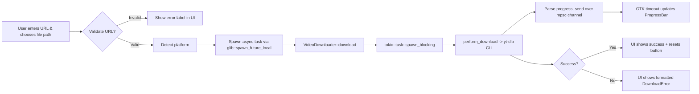

# VDownloader Architecture

_Last updated: December 2025_

## 1. High-Level Overview

VDownloader is a desktop video downloader implemented as a GTK4 application written in Rust. The codebase is intentionally compact:

- **Executable entry point (`src/main.rs`)** sets up logging, launches a Tokio runtime, and boots the GTK application.
- **UI layer (`src/ui`)** owns all GTK widget construction and user interaction logic. It gathers user input, surfaces status/progress information, and dispatches download jobs.
- **Core layer (`src/core`)** exposes download-related types (`VideoDownloader`, `DownloadRequest`, `DownloadQueue`, `DownloadError`). Heavy work (yt-dlp invocation, filesystem interaction) is isolated here and run off the GTK thread via `tokio::task::spawn_blocking`.
- **External tooling** relies on the `yt-dlp` CLI for actual media downloads. The Rust crate `youtube_dl` is used only to fetch metadata/playlist information before invoking the CLI.

This separation keeps the UI responsive while long-running downloads execute in the background.

## 2. Runtime Components & Responsibilities

### 2.1 Entry Point (`src/main.rs`)
- Initializes `env_logger` for the `log` facade.
- Creates a dedicated Tokio runtime (multi-threaded, full features) so async code can run even though GTK owns the main loop.
- Builds the GTK `Application`, connects the `activate` signal, and presents the main window.

### 2.2 UI Layer (`src/ui`)
- `window.rs` builds the entire GTK hierarchy (header text, URL inputs, file picker, overwrite toggle, progress bar, and a placeholder download queue frame).
- Maintains UI state with `Rc<RefCell<String>>` for the selected file path plus GTK widget references cloned into signal handlers.
- Uses `gtk4::glib::spawn_future_local` to run async download tasks without blocking the UI thread.
- Uses a `std::sync::mpsc::channel` combined with `glib::timeout_add_local` to shuttle progress updates from the download task into the GTK thread.
- Calls into `VideoDownloader` with a fully-formed `DownloadRequest` (URL, detected platform, output path, overwrite flag).

### 2.3 Core Layer (`src/core`)
- `downloader.rs`
  - Defines `Platform`, `DownloadRequest`, `DownloadStatus`, and the `VideoDownloader` service.
  - Provides synchronous helpers (`validate_url`, `sanitize_url`, `detect_platform`) and an async `download` method that wraps a blocking `perform_download` call.
  - Invokes `yt-dlp` via `std::process::Command`, parses progress output, and reports completion or rich error variants.
- `queue.rs`
  - Implements a `DownloadQueue` backed by `tokio::sync::RwLock<HashMap<...>>` with CRUD-style operations.
  - Currently unused by the UI; included as groundwork for future multi-download coordination.
- `error.rs`
  - Houses the `DownloadError` enum (deriving `thiserror::Error + Clone`) used throughout the core and surfaced to the UI for user-friendly status messages.

### 2.4 External Tooling & Services
- **yt-dlp CLI** must be installed on the host. The application shells out to it for actual file downloads.
- **GTK/GLib stack** governs the application lifecycle, windowing, dialogs, and repeated idle callbacks.
- No network APIs beyond what `yt-dlp` handles internally; there is currently no search API integration.

## 3. Platform Handling & Workflow

### 3.1 `Platform` Enum
Located in `src/core/downloader.rs`, it currently covers:

- `YouTube`
- `TikTok`
- `Twitter`
- `Instagram`
- `Reddit`
- `Vk`
- `Rutube`
- `Dzen`
- `Other` (fallback)

`VideoDownloader::detect_platform(&str)` performs straightforward substring checks on the URL to choose a variant. The selected platform is stored in `DownloadRequest` and can be used for telemetry or future provider-specific features, but today it primarily tags requests for potential queue presentation.

### 3.2 Download Workflow



Key characteristics:
- CPU/IO-bound work (invoking `yt-dlp`, parsing stdout) is isolated inside `spawn_blocking` so the GTK main loop stays responsive.
- Progress updates propagate through a thread-safe channel to avoid GTK thread violations.
- Errors bubble up as `DownloadError` and are formatted centrally before updating the UI.

### 3.3 State Management & Data Flow
- User-configurable state (URL, output path, overwrite toggle) lives in GTK widgets; the selected path additionally exists in an `Rc<RefCell<String>>` to share between closures.
- `DownloadRequest` captures an immutable snapshot of the task configuration and passes it into the core layer.
- The download queue is not yet connected; UI simply shows a placeholder frame.

### 3.4 Error Handling Strategy
- `DownloadError` variants distinguish between validation, network, filesystem, unsupported platform, and cancellation cases.
- The UI calls `format_error(&DownloadError)` to convert an enum variant into user-facing strings. This keeps the status messaging consistent and centralized.

### 3.5 Queue Subsystem Status
- `DownloadQueue` and `DownloadStatus` are defined but unused.
- No persistence or visualization of queued jobs exists yet—the GTK component merely informs future work.
- Integrating the queue will require wiring UI actions (add/start/cancel) to the queue APIs and reflecting `DownloadStatus` changes in the placeholder frame.

### 3.6 Search Functionality
- There is **no search module** in the current codebase. README references planned search features, but no crates, modules, or config scaffolding have been added. Any roadmap for search needs to start from scratch.

## 4. Configuration & Environment
- There is no dedicated configuration loader.
- The only environment usage today is to determine the default download path (`HOME` or `USERPROFILE`) when pre-filling the "Save As" location.
- Users must manually install `yt-dlp` and GTK runtime dependencies following the README instructions.
- Future enhancements (API keys, per-platform options) will require introducing a configuration module and persistence layer.

## 5. Build, Tooling, and Dependencies

| Dependency | Version | Purpose |
|------------|---------|---------|
| `gtk4` | 0.9 (`v4_10` feature) | GTK widgets, dialogs, application lifecycle |
| `glib` | 0.20 | GLib types, idle sources, shared GTK utilities |
| `gio` | 0.20 | File dialogs and GIO abstractions |
| `tokio` | 1.35 (`full`) | Async runtime used by the downloader and queue |
| `youtube_dl` | 0.9 | Fetch video/playlist metadata before running `yt-dlp` |
| `regex` | 1.12.2 | URL sanitization (VK playlist handling) |
| `serde`, `serde_json` | 1.0 | Serialization for request/status types and potential persistence |
| `thiserror` | 1.0 | Derive-based error enums in the core layer |
| `anyhow` | 1.0 | Placeholder for ergonomic error handling (not widely used yet) |
| `log` | 0.4 | Structured logging across the app |
| `env_logger` | 0.11 | Runtime-configurable log subscriber |

Build commands (from README) follow standard Cargo workflows (`cargo build`, `cargo run`, `cargo test`, `cargo fmt`, `cargo clippy`). There are no custom scripts or Makefiles.

## 6. Testing & Coverage
- `core::downloader` provides unit tests for platform detection, URL validation, output directory checks, and VK-specific sanitization logic.
- `core::queue` uses `#[tokio::test]` to validate basic queue operations.
- UI code currently lacks automated tests due to GTK's graphical nature.
- There is no integration test orchestrating the full download workflow or verifying CLI availability.

> **Note:** The queue tests need to be updated to include the `overwrite` field when constructing `DownloadRequest`; otherwise they will fail to compile. This is an example of technical debt flagged below.

## 7. Feature Inventory & Known Limitations

| Status | Feature |
|--------|---------|
| ✅ Working | Single download flow for URL ➝ file (with overwrite toggle and progress bar) |
| ✅ Working | Platform auto-detection via URL inspection |
| ⚠️ Partial | Download queue data structures exist but aren't wired to the UI |
| ⚠️ Partial | UI mentions multi-platform support, but `Platform` enum currently only differentiates YouTube/TikTok/Twitter/Instagram/Reddit/Other |
| 🚧 Planned | Additional providers (VK Video, Rutube, Dzen) listed in README but not implemented in `Platform` |
| 🚧 Planned | Search experience and history management described in README but absent in code |
| 🚧 Planned | Persistent settings / configuration system |

Additional limitations / technical debt:
- Platform detection is substring-based and does not validate domains rigorously.
- The `DownloadStatus` enum is unused, preventing visibility into progress/state transitions beyond the active download.
- Error differentiation for playlist handling is minimal and should include user guidance (e.g., unsupported playlist downloads).
- No retry/backoff or cancellation pipeline exists.
- Tests do not cover the async download path or interaction with `yt-dlp` (requires integration harness/mocking).

## 8. Extension Points & Recommendations

1. **Hook the queue to the UI**
   - Use `DownloadQueue` as the single source of truth for in-progress/completed jobs.
   - Mirror the queue contents inside `download_queue.rs` instead of a static placeholder.

2. **Expand platform handling**
   - Extract `Platform` into its own module to make it reusable across forthcoming search/download features.
   - Replace substring matching with URL parsing (`url` crate) for reliability.

3. **Introduce configuration management**
   - Define a `Config` struct (e.g., `toml`-backed) to store default output paths, concurrency limits, and API keys if search is implemented.

4. **Search feature scaffolding**
   - When adding search, create a `core::search` module with provider traits, async service fan-out, and UI surfaces.

5. **Improve testing**
   - Add unit tests for queue integration with overwrite flag.
   - Consider using dependency injection or feature flags to mock `yt-dlp` for deterministic integration tests.

6. **Error & progress reporting**
   - Surface meaningful platform-specific errors (geoblocking, rate limits) once `yt-dlp` output parsing is enhanced.

## 9. Common Patterns & Examples

- **Spawning async work from GTK:**
  ```rust
  gtk4::glib::spawn_future_local(async move {
      match downloader.download(request, move |progress| {
          let _ = sender.send(progress);
      }).await {
          Ok(path) => { /* update UI */ }
          Err(err) => { /* format + show error */ }
      }
  });
  ```

- **Updating UI from periodic callbacks:**
  ```rust
  gtk4::glib::timeout_add_local(Duration::from_millis(50), move || {
      match receiver.try_recv() {
          Ok(progress) => {
              progress_bar.set_fraction(progress as f64);
          }
          Err(TryRecvError::Empty) => return ControlFlow::Continue,
          Err(TryRecvError::Disconnected) => return ControlFlow::Break,
      }
  });
  ```

These patterns illustrate how background work safely communicates with GTK widgets and should be reused for future features (e.g., queue updates, search requests).
